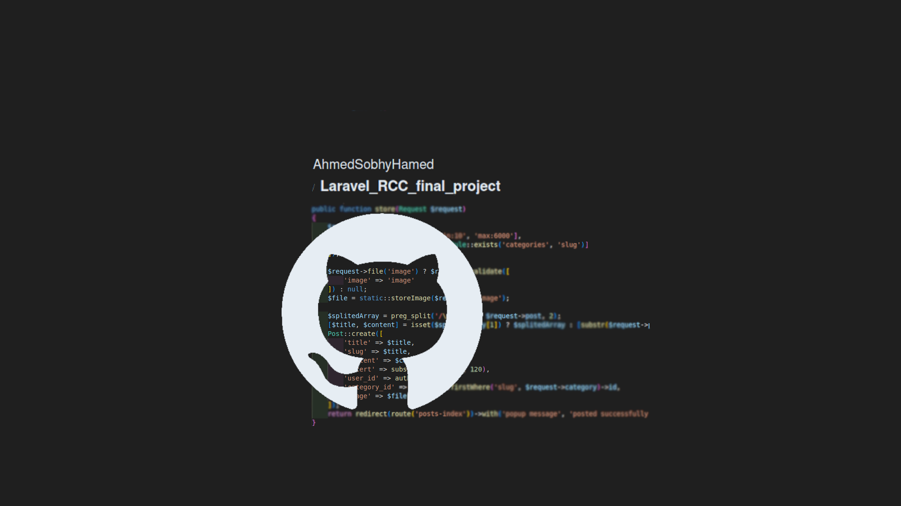

# Laravel_RCC_final_project

RCC practicing course: using Laravel to create a very small, incomplete e-commerce system and implementing the Filament library to create a dashboard.



## Table of Contents

-   [Introduction](#introduction)
-   [Features](#features)
-   [Installation](#installation)
-   [Usage](#usage)
-   [Technologies Used](#technologies-used)
-   [License](#license)
-   [Contact](#contact)

  <!-- intro -->

## Introduction

Incomplete project for practicing new features of Laravel and Filament to create an e-commerce website and a dashboard to add products.

  <!-- technologies was used with links if available -->

## Features

```diff
    Using MVC architecture.
    Using Laravel Authentication system.
    Using Filament Library.
    Using ORM Laravel eloquent models.
    Create CRUD system.
    Using yield-section blade approach.
```

  <!-- get start and how to run with the prerequisites mintion -->

## Installation

1. install pre-requisies utilities

    - install php
      on Ubuntu, Debian, and Linux Mint:

        ```sh
        sudo apt-get install php8.1 php8.1-cli php8.1-common php8.1-curl php8.1-mysql
        ```

    - install mysql
      on Ubuntu, Debian, and Linux Mint:

        ```sh
        sudo apt-get install mysql-client-8.0 mysql-client-core-8.0 mysql-server-core-8.0
        ```

    - install composer
      on Ubuntu, Debian, and Linux Mint:

        ```sh
        sudo apt-get install composer
        ```

    - install npm
      on Ubuntu, Debian, and Linux Mint:

        ```sh
        sudo apt-get install nodejs npm
        ```

2. Clone the repository:

    ```sh
    git clone https://github.com/AhmedSobhyHamed/Laravel_RCC_final_project.git
    ```

3. Navigate to the project directory:

    ```sh
    cd work_directory
    ```

4. Install dependencies:

    - laravel dependencies

        ```sh
        compose install
        ```

    - node dependencies

        ```sh
        npm install
        ```

5. Set up environment variables:

    ```sh
    cp .env.example .env
    ```

6. Link storage to public folder:

    ```sh
    php artisan storage:link
    ```

7. Create Database and User:

    - open mysql

        ```sh
        sudo mysql
        ```

    - create database

        ```sh
        CREATE DATABASE RCC-database;
        ```

    - create user

        ```sh
        CREATE USER IF NOT EXISTS
        'RCC_user'@'localhost' IDENTIFIED WITH caching_sha2_password BY 'password'
        REQUIRE NONE
        WITH MAX_CONNECTIONS_PER_HOUR 1800 MAX_USER_CONNECTIONS 5
        PASSWORD EXPIRE NEVER FAILED_LOGIN_ATTEMPTS 5 PASSWORD REQUIRE CURRENT PASSWORD_LOCK_TIME 1;
        ```

    - grant privilages

        ```sh
        GRANT INSERT,UPDATE,DELETE,SELECT,CREATE,DROP,ALTER,REFERENCES ON `RCC-database`.* TO 'RCC_user'@'localhost';
        FLUSH PRIVILEGES;
        ```

8. Migrate tables:

    ```sh
    php artisan migrate
    ```

9. Start the application:

    ```sh
    php artisan serve
    ```

    Then open the browser to the link typed in the terminal.

  <!-- usage or how to interact with this technologies like api end points and what they do -->

## Usage

<!-- **You can interact with the project via this link**
[web page on github](https://ahmedsobhyhamed.github.io/Laravel_RCC_final_project/).
<br> -->

**[see an example for user interaction.[video]](http://youtube.com)**

#### Interacting with endpoints in the browser:

1. Register for an account or log in with existing credentials

    ```diff
    http://localhost:8000/login
    http://localhost:8000/signup
    ```

2. View all products (home page).

    ```diff
    http://localhost:8000/
    ```

3. View a specific product.

    ```diff
    http://localhost:8000/product/{id}
    ```

4. Go to the 'about' page.

    ```diff
    http://localhost:8000/about
    ```

5. Go to the 'contact' page.

    ```diff
    http://localhost:8000/contact
    ```

6. Go to the 'user profile' page.

    ```diff
    http://localhost:8000/profile
    ```

    6. Go to the 'user dashboard' page.

    ```diff
    http://localhost:8000/dashboard
    ```

## Technologies Used

-   languages:

    -   PHP
    -   mysql
    -   HTML 5.
    -   CSS

-   framworks:

    -   Laravel
    -   Bootstrap
    -   Filament

  <!-- licance -->

## License

This project is licensed under the MIT License - see the [LICENSE](/LICENSE) file for details

  <!-- contacts -->

## Contact

Created by [Ahmed Sobhy]:

-   email: [ahmed.s.abdulaal@gmail.com](mailto:ahmed.s.abdulaal@gmail.com)
-   linkedin: [Ahmed Sobhy](https://www.linkedin.com/in/ahmed-sobhy-b824b7201/)
    <br>
    feel free to contact me!
